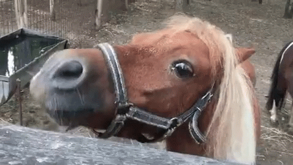

# BDOHorseDrop

This is a Horse drop module that lets you drop all your trash to your horse, when you go for repair cycle.
It will run to your horse, drop trash and run back to your tent starting point and continue the profile from there.

Useful for: 
  1.  Not having enough maids 
  2. Not having enough Inventory weight to carry heavy trash.

Important notes to use module:
1. Hotkey your "Interaction 2" to F5
Esc --> Settings --> Interface Settings --> Action Hotkeys --> Interactions 2  =  F5
https://i.imgur.com/r8cnaBD.png

2. Park your horse AWAY from your tent ( cannot sit super close to tent) preffereably around 20-30 meters away, (hover over horse icon to see the range)
https://i.imgur.com/mGpg1Bs.png

3 If you have setup the tent hotkeys as told in ⁠general-settings  you should be good to go.

Download Module:
https://drive.google.com/drive/folders/1OxmC2TtZOhggwniPDWDqvf60RGMXJRD-?usp=sharing

